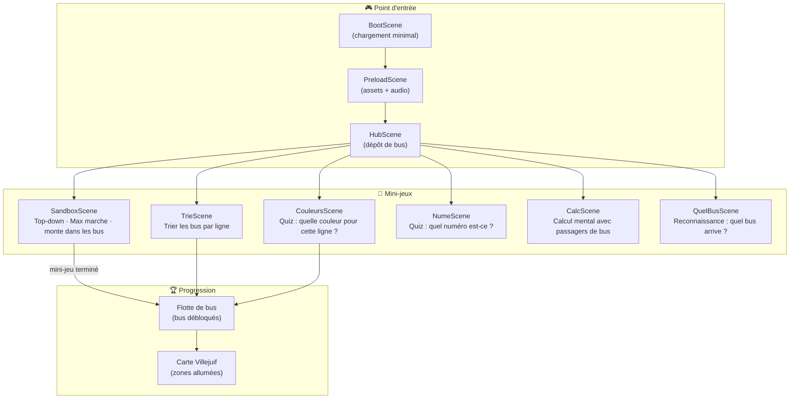
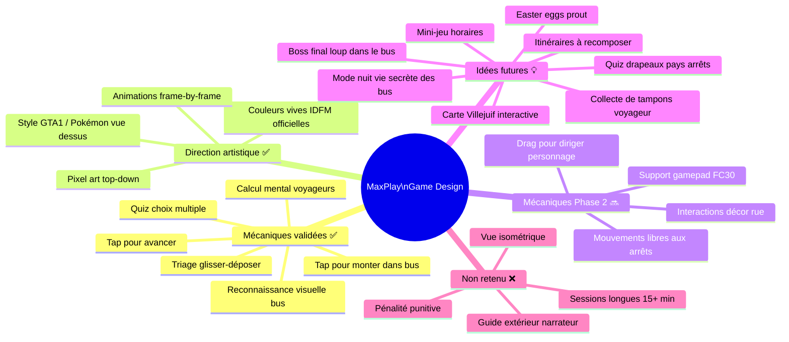
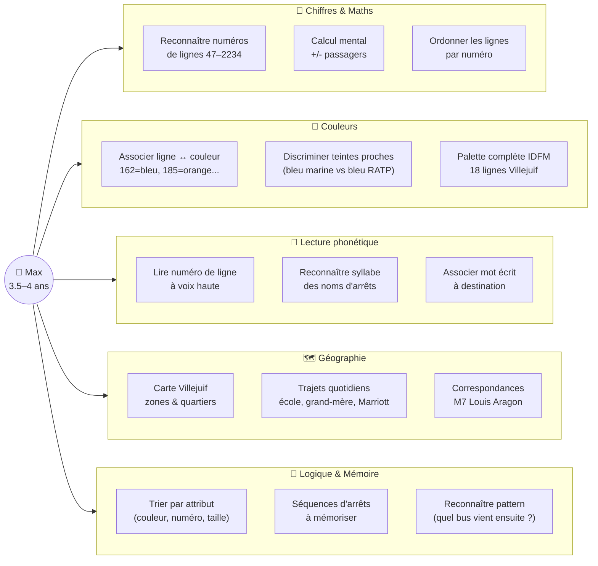
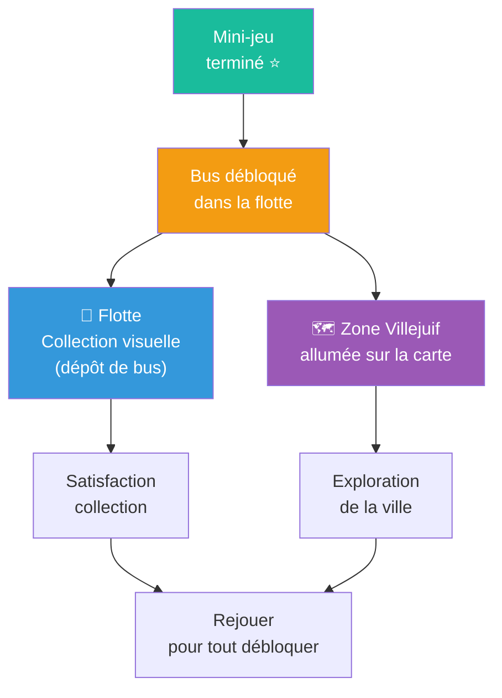
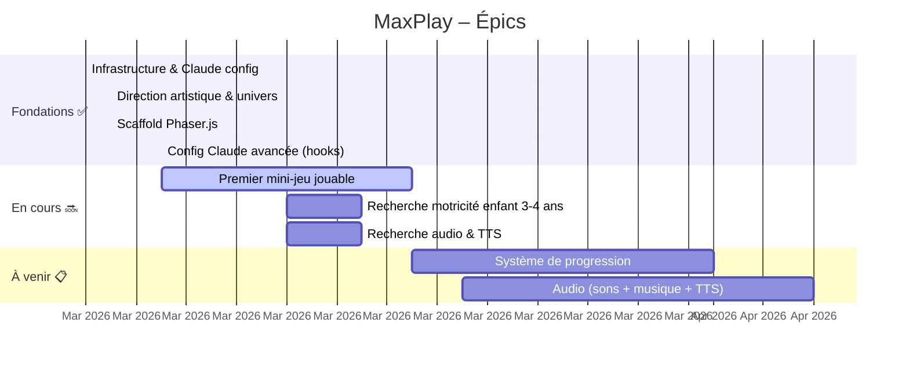
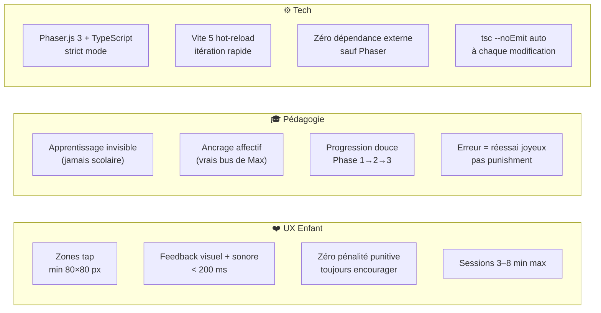

# 🚌 MaxPlay

> Jeu éducatif 2D pour **Max** (3.5–4 ans), passionné de bus Villejuif.
> Apprendre en jouant avec les vraies lignes IDFM — sans jamais que ça ressemble à de l'école.

---

## Concept

Max connaît toutes les lignes de bus autour de chez lui, leurs couleurs, leurs numéros, leurs itinéraires.
MaxPlay transforme cette passion en levier d'apprentissage naturel : chiffres, couleurs, lecture phonétique, géographie, logique.

**Les bus ont une vie secrète.** Le jour, ce sont les vrais bus de Villejuif. La nuit, ils ont des émotions, parlent entre eux, vivent des aventures. Max est avec eux — dedans, à leurs côtés — pas spectateur.

---

## Stack

| | |
|---|---|
| **Moteur** | Phaser.js 3 |
| **Build** | Vite 5 + TypeScript strict |
| **Cible** | Navigateur desktop + tablet, paysage 1024×768 |
| **Assets** | SVG/PNG, Web Audio API synthesisé |
| **Input** | Tactile (tablet) + Gamepad 8BitDo FC30 |

---

## Architecture du jeu



---

## Univers de Game Design



---

## Branches pédagogiques



---

## Système de progression



---

## Roadmap



---

## Lignes de bus Villejuif

Les vraies couleurs officielles IDFM — cœur du jeu.

| Ligne | Couleur | Hex | Ancrage Max |
|-------|---------|-----|-------------|
| **162** | 🟦 Bleu RATP | `#0064B1` | Ligne du quartier |
| **172** | 🟢 Vert | `#008C59` | Quotidien |
| **185** | 🟠 Orange | `#F58443` | **Ligne école** ⭐ |
| **2234** | 🟣 Violet | `#652C90` | Marriott / Marne-la-Vallée ⭐ |
| **TVM** | 🔵 Bleu TVM | `#216EB4` | Trans-Val-de-Marne |
| **286** | 🪻 Lilas | `#C9A2CD` | |
| **380** | 🟩 Vert clair | `#75CE89` | |
| **323** | 🟡 Jaune-vert | `#CEC92A` | |
| **125** | 🔵 Bleu | `#006EB8` | |
| **131** | 🟤 Brun | `#8D653A` | |
| **132** | 🟣 Violet | `#652C90` | |
| **184** | 🟡 Jaune-or | `#DCAC27` | |
| **186** | 🌸 Rose-violet | `#B43C95` | |
| **47** | 🩷 Rose | `#FF82B4` | |
| **180** | 🫒 Olive | `#9B9839` | |
| **N15/N22** | 🌙 Bleu nuit | `#000091` | Lignes de nuit |
| **M7** | 🔴 Violet/Rose | — | Villejuif Louis Aragon |

---

## Règles de design (non-négociables)



---

## Structure du projet

```
MaxPlay/
├── game/                    ← Phaser.js (TypeScript, Vite)
│   └── src/
│       ├── scenes/          ← BootScene, PreloadScene, HubScene, SandboxScene...
│       ├── constants/       ← colors.ts (vraies couleurs IDFM), config.ts
│       └── main.ts
├── game-html/               ← Version vanilla HTML/JS (7 mini-jeux auto-contenus)
│   └── index.html
├── docs/
│   ├── VISION.md            ← Options ouvertes + décisions
│   ├── MAX_PROFILE.md       ← Profil Max (lignes, passions, géographie)
│   └── REFERENCES.md        ← Ressources et liens
├── tasks/
│   └── BACKLOG.md           ← Source de vérité : épics, tâches, leçons
├── memory/
│   └── MEMORY.md            ← Mémoire Claude (auto-chargée)
└── CLAUDE.md                ← Instructions opérationnelles Claude
```

---

## Lancer le jeu Phaser

```bash
cd game
npm install
npm run dev
# → http://localhost:5173
```

## Version HTML (standalone)

Ouvrir directement `game-html/index.html` dans un navigateur — aucune installation requise.
Contient 7 mini-jeux complets : Sandbox, Trie, Couleurs, Numéros, Calcul, Quel Bus.

---

## Profil Max

| | |
|---|---|
| **Âge** | 3.5–4 ans |
| **Quartier** | Villejuif Feuillantines (Val-de-Marne) |
| **Chiffres** | Compte seul jusqu'à 100, milliers avec aide |
| **Lecture** | Phonétique en cours, progression rapide |
| **Passions** | Bus 🚌 · Animaux 🐾 · Loups 🐺 · Drapeaux 🏳️ · Tayo · Ghibli · Stitch |
| **Input** | Tablet tactile |
| **Humour** | Phase pipi-caca-prout classique 3-4 ans 😄 |

---

*Built with ❤️ by un papa dev · Powered by Claude Code*
